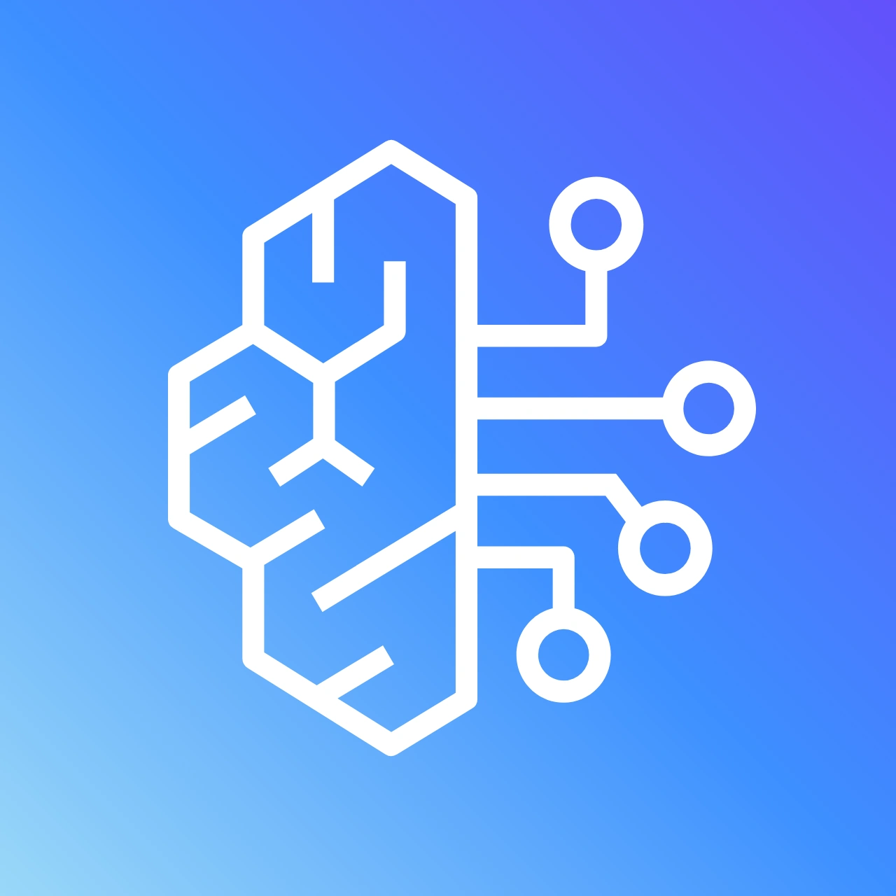

<p align="center">
  
</p>

<h1 align="center">AWS Bedrock for Copilot</h1>

<p align="center">
  <a href="https://github.com/rangan2510/aws-bedrock-for-copilot/releases/latest"></a>
  <a href="https://github.com/rangan2510/aws-bedrock-for-copilot/blob/main/LICENSE"></a>
  <a href="https://github.com/rangan2510/aws-bedrock-for-copilot"></a>
</p>

This is a development fork of [amazon-bedrock-copilot-chat](https://github.com/tinovyatkin/amazon-bedrock-copilot-chat) by [@tinovyatkin](https://github.com/tinovyatkin). All the foundational work -- the provider architecture, streaming, authentication, message conversion -- is from the original project. This fork exists for quick bugfixes and enhancements for internal use, and runs **alongside** the upstream extension without conflicts.

> **Important**: Models provided through the Language Model Chat Provider API are currently only available to users on **individual GitHub Copilot plans**. Organization plans are not yet supported.

## What this fork changes

Fixes and enhancements over the upstream `v0.11.0`:

- **Claude Opus 4.7 support**: Handles the new `thinking.type: "adaptive"` API requirement and the deprecated `temperature` parameter that Opus 4.7 introduced
- **Correct thinking modes per model**: CLI-verified thinking configuration for every Claude generation -- adaptive for Opus 4.7, enabled+budget for 4.5/4.1/4/3.7/Haiku 4.5, both for 4.6 models
- **Correct token limits**: Opus 4.7 gets 1M context / 128K output, Opus 4.1/4 corrected to 32K output, per Anthropic docs
- **Haiku 4.5 extended thinking**: Added missing thinking support for Claude Haiku 4.5
- **Graceful tool_use fallback**: Models that return unparseable tool JSON no longer crash -- shows a helpful message instead
- **Expanded provider profiles**: CLI-verified tool calling and vision support for 80+ models across 14 providers (Qwen, Kimi, GLM, MiniMax, NVIDIA, Gemma, DeepSeek, Writer, Cohere, AI21, and more)
- **Parallel extension identity**: Runs as `aws-bedrock-for-copilot` vendor with its own config namespace (`aws-bedrock-for-copilot.*`), so it can be installed next to the upstream `bedrock` extension

## Features

- **80+ Bedrock models**: All text-generation models with tool calling support, including Claude, Llama, Mistral, Qwen, DeepSeek, Kimi, GLM, Gemma, Nova, and more (see [Supported Models](#supported-models))
- **Flexible authentication**: AWS Profiles, API Keys (bearer tokens), or Access Keys -- all stored securely in VSCode SecretStorage
- **Streaming**: Real-time streaming responses via the Bedrock ConverseStream API
- **Tool calling**: Full function calling support, required for Copilot Chat features like `@workspace` and `@terminal`
- **Cross-region inference**: Automatic support for regional and global inference profiles
- **Extended thinking**: Automatic thinking configuration per model generation -- adaptive thinking for Opus 4.7, enabled+budget for older models, with configurable effort levels for supported models
- **1M context window**: Always-on 1M context for Opus 4.7; optional 1M for Opus 4.6 and Sonnet 4.6 (configurable in settings)
- **Prompt caching**: Automatic caching of system prompts, tool definitions, and conversation history (Claude and Nova models)
- **Vision**: Image input support for models that declare IMAGE modality

## Prerequisites

- Visual Studio Code version 1.104.0 or higher
- GitHub Copilot extension
- AWS credentials (AWS Profile, API Key, or Access Keys)
- Access to Amazon Bedrock in your AWS account

## Installation

1. Download the latest VSIX from this repo's releases (or build with `bun run vsce:package`)
2. Install: `code --install-extension dist/extension.vsix`
3. Configure your AWS credentials if you haven't already:
   - See [AWS CLI Configuration](https://docs.aws.amazon.com/cli/latest/userguide/cli-configure-files.html) for details
4. Run the "Manage AWS Bedrock for Copilot" command to select your AWS profile and region

## Configuration

### Authentication Methods

This extension supports three authentication methods:

1. **AWS Profile** (recommended) - Uses named profiles from `~/.aws/credentials` and `~/.aws/config`
2. **API Key** - Uses [Amazon Bedrock API key](https://docs.aws.amazon.com/bedrock/latest/userguide/api-keys.html) (stored securely in VSCode SecretStorage)
3. **Access Keys** - Uses AWS access key ID and secret (stored securely in VSCode SecretStorage)

To configure:

1. Open the Command Palette (`Cmd+Shift+P` or `Ctrl+Shift+P`)
2. Run "Manage AWS Bedrock for Copilot"
3. Choose "Set Authentication Method" to select your preferred method
4. Follow the prompts to enter credentials
5. Choose "Set Region" to select your preferred AWS region

### Available Regions

The extension supports all AWS partitions including:

- **Commercial AWS** - All standard regions (us-east-1, eu-west-1, ap-southeast-2, etc.)
- **AWS GovCloud (US)** - us-gov-west-1, us-gov-east-1
- **AWS China** - cn-north-1, cn-northwest-1

See [Model support by AWS Region in Amazon Bedrock](https://docs.aws.amazon.com/bedrock/latest/userguide/models-regions.html) for the latest list of supported regions and [GOVCLOUD-COMPATIBILITY.md](./GOVCLOUD-COMPATIBILITY.md) for partition-specific details.

## Usage

Once configured, Bedrock models will appear in GitHub Copilot Chat's model selector. Simply:

1. Open GitHub Copilot Chat
2. Click on the model selector
3. Choose a model under **AWS Bedrock for Copilot** (separate from the upstream "Amazon Bedrock" if both are installed)
4. Start chatting!

## Supported Models

The extension automatically discovers and displays models from your Amazon Bedrock account. Models must be **enabled** in your [Bedrock Model Access console](https://console.aws.amazon.com/bedrock/home#/modelaccess).

For a model to work with GitHub Copilot Chat, it must support **tool calling** (function calling). The table below documents all available text-generation models and their capabilities, CLI-verified against the Bedrock Converse API as of April 2026 in `us-east-1`.

### Anthropic Claude

| Model             | Model ID                                    | Vision | Tools | Thinking                     | Notes                                                |
| ----------------- | ------------------------------------------- | ------ | ----- | ---------------------------- | ---------------------------------------------------- |
| Claude Opus 4.7   | `anthropic.claude-opus-4-7`                 | Yes    | Yes   | adaptive + effort            | 1M context, 128K output, no temperature              |
| Claude Opus 4.6   | `anthropic.claude-opus-4-6-v1`              | Yes    | Yes   | enabled or adaptive + effort | 1M context optional, 128K output                     |
| Claude Opus 4.5   | `anthropic.claude-opus-4-5-20251101-v1:0`   | Yes    | Yes   | enabled + budget             | 200K context, 64K output, no effort                  |
| Claude Opus 4.1   | `anthropic.claude-opus-4-1-20250805-v1:0`   | Yes    | Yes   | enabled + budget             | 200K context, 32K output                             |
| Claude Opus 4     | `anthropic.claude-opus-4-20250514-v1:0`     | Yes    | Yes   | enabled + budget             | 200K context, 32K output (deprecated June 2026)      |
| Claude Sonnet 4.6 | `anthropic.claude-sonnet-4-6`               | Yes    | Yes   | enabled or adaptive + effort | 64K max output, 1M context optional                  |
| Claude Sonnet 4.5 | `anthropic.claude-sonnet-4-5-20250929-v1:0` | Yes    | Yes   | enabled + budget             | No effort support                                    |
| Claude Sonnet 4   | `anthropic.claude-sonnet-4-20250514-v1:0`   | Yes    | Yes   | enabled + budget             |                                                      |
| Claude 3.7 Sonnet | `anthropic.claude-3-7-sonnet-20250219-v1:0` | Yes    | Yes   | enabled + budget             |                                                      |
| Claude Haiku 4.5  | `anthropic.claude-haiku-4-5-20251001-v1:0`  | Yes    | Yes   | enabled + budget             | No effort support                                    |
| Claude 3.5 Haiku  | `anthropic.claude-3-5-haiku-20241022-v1:0`  | No     | Yes   | No                           |                                                      |
| Claude 3 Sonnet   | `anthropic.claude-3-sonnet-20240229-v1:0`   | Yes    | Yes   | No                           |                                                      |
| Claude 3 Haiku    | `anthropic.claude-3-haiku-20240307-v1:0`    | Yes    | Yes   | No                           |                                                      |

### Amazon Nova

| Model        | Model ID                   | Vision | Tools | Notes                      |
| ------------ | -------------------------- | ------ | ----- | -------------------------- |
| Nova Premier | `amazon.nova-premier-v1:0` | Yes    | Yes   | Requires inference profile |
| Nova Pro     | `amazon.nova-pro-v1:0`     | Yes    | Yes   | Also accepts video input   |
| Nova 2 Lite  | `amazon.nova-2-lite-v1:0`  | Yes    | Yes   | Also accepts video input   |
| Nova Lite    | `amazon.nova-lite-v1:0`    | Yes    | Yes   | Also accepts video input   |
| Nova Micro   | `amazon.nova-micro-v1:0`   | No     | Yes   | Text only                  |

### Meta Llama

| Model                | Model ID                                 | Vision | Tools | Notes                      |
| -------------------- | ---------------------------------------- | ------ | ----- | -------------------------- |
| Llama 4 Maverick 17B | `meta.llama4-maverick-17b-instruct-v1:0` | Yes    | Yes   |                            |
| Llama 4 Scout 17B    | `meta.llama4-scout-17b-instruct-v1:0`    | Yes    | Yes   | Requires inference profile |
| Llama 3.3 70B        | `meta.llama3-3-70b-instruct-v1:0`        | No     | Yes   | Requires inference profile |
| Llama 3.2 90B        | `meta.llama3-2-90b-instruct-v1:0`        | Yes    | Yes   | Requires inference profile |
| Llama 3.2 11B        | `meta.llama3-2-11b-instruct-v1:0`        | Yes    | Yes   | Requires inference profile |
| Llama 3.2 3B         | `meta.llama3-2-3b-instruct-v1:0`         | No     | Yes   |                            |
| Llama 3.2 1B         | `meta.llama3-2-1b-instruct-v1:0`         | No     | Yes   |                            |
| Llama 3.1 70B        | `meta.llama3-1-70b-instruct-v1:0`        | No     | Yes   | Requires inference profile |
| Llama 3.1 8B         | `meta.llama3-1-8b-instruct-v1:0`         | No     | Yes   |                            |
| Llama 3 70B          | `meta.llama3-70b-instruct-v1:0`          | No     | Yes   |                            |
| Llama 3 8B           | `meta.llama3-8b-instruct-v1:0`           | No     | Yes   |                            |

### Mistral AI

| Model                 | Model ID                                | Vision | Tools  | Notes                      |
| --------------------- | --------------------------------------- | ------ | ------ | -------------------------- |
| Mistral Large 3       | `mistral.mistral-large-3-675b-instruct` | Yes    | Yes    |                            |
| Pixtral Large         | `mistral.pixtral-large-2502-v1:0`       | Yes    | Yes    | Requires inference profile |
| Magistral Small       | `mistral.magistral-small-2509`          | Yes    | Yes    |                            |
| Devstral 2 123B       | `mistral.devstral-2-123b`               | No     | Yes    |                            |
| Ministral 14B 3.0     | `mistral.ministral-3-14b-instruct`      | Yes    | Yes    |                            |
| Ministral 3 8B        | `mistral.ministral-3-8b-instruct`       | Yes    | Yes    |                            |
| Ministral 3B          | `mistral.ministral-3-3b-instruct`       | Yes    | Yes    |                            |
| Voxtral Small 24B     | `mistral.voxtral-small-24b-2507`        | No     | Yes    | Speech + text input        |
| Voxtral Mini 3B       | `mistral.voxtral-mini-3b-2507`          | No     | Yes    | Speech + text input        |
| Mistral Large (24.02) | `mistral.mistral-large-2402-v1:0`       | No     | Yes    |                            |
| Mistral Small (24.02) | `mistral.mistral-small-2402-v1:0`       | No     | Yes    |                            |
| Mistral 7B            | `mistral.mistral-7b-instruct-v0:2`      | No     | **No** | Legacy, no tool calling    |
| Mixtral 8x7B          | `mistral.mixtral-8x7b-instruct-v0:1`    | No     | **No** | Legacy, no tool calling    |

### DeepSeek

| Model         | Model ID           | Vision | Tools  | Notes                            |
| ------------- | ------------------ | ------ | ------ | -------------------------------- |
| DeepSeek V3.2 | `deepseek.v3.2`    | No     | Yes    |                                  |
| DeepSeek R1   | `deepseek.r1-v1:0` | No     | **No** | Reasoning model, no tool calling |

### Qwen

| Model                 | Model ID                        | Vision | Tools | Notes                 |
| --------------------- | ------------------------------- | ------ | ----- | --------------------- |
| Qwen3 VL 235B A22B    | `qwen.qwen3-vl-235b-a22b`       | Yes    | Yes   | Vision-language model |
| Qwen3 Coder 480B A35B | `qwen.qwen3-coder-next`         | No     | Yes   |                       |
| Qwen3 Next 80B A3B    | `qwen.qwen3-next-80b-a3b`       | No     | Yes   |                       |
| Qwen3 32B (dense)     | `qwen.qwen3-32b-v1:0`           | No     | Yes   |                       |
| Qwen3 Coder 30B A3B   | `qwen.qwen3-coder-30b-a3b-v1:0` | No     | Yes   |                       |

### Google

| Model       | Model ID                | Vision | Tools | Notes |
| ----------- | ----------------------- | ------ | ----- | ----- |
| Gemma 3 27B | `google.gemma-3-27b-it` | Yes    | Yes   |       |
| Gemma 3 12B | `google.gemma-3-12b-it` | Yes    | Yes   |       |
| Gemma 3 4B  | `google.gemma-3-4b-it`  | Yes    | Yes   |       |

### OpenAI (OSS)

| Model                  | Model ID                        | Vision | Tools | Notes                |
| ---------------------- | ------------------------------- | ------ | ----- | -------------------- |
| GPT OSS 120B           | `openai.gpt-oss-120b-1:0`       | No     | Yes   |                      |
| GPT OSS 20B            | `openai.gpt-oss-20b-1:0`        | No     | Yes   |                      |
| GPT OSS Safeguard 120B | `openai.gpt-oss-safeguard-120b` | No     | Yes   | Content safety model |
| GPT OSS Safeguard 20B  | `openai.gpt-oss-safeguard-20b`  | No     | Yes   | Content safety model |

### Moonshot AI (Kimi)

| Model            | Model ID                    | Vision | Tools | Notes           |
| ---------------- | --------------------------- | ------ | ----- | --------------- |
| Kimi K2.5        | `moonshotai.kimi-k2.5`      | Yes    | Yes   |                 |
| Kimi K2 Thinking | `moonshot.kimi-k2-thinking` | No     | Yes   | Reasoning model |

### Z.AI (GLM)

| Model         | Model ID            | Vision | Tools | Notes |
| ------------- | ------------------- | ------ | ----- | ----- |
| GLM 5         | `zai.glm-5`         | No     | Yes   |       |
| GLM 4.7 Flash | `zai.glm-4.7-flash` | No     | Yes   |       |
| GLM 4.7       | `zai.glm-4.7`       | No     | Yes   |       |

### MiniMax

| Model        | Model ID               | Vision | Tools | Notes |
| ------------ | ---------------------- | ------ | ----- | ----- |
| MiniMax M2.5 | `minimax.minimax-m2.5` | No     | Yes   |       |
| MiniMax M2.1 | `minimax.minimax-m2.1` | No     | Yes   |       |
| MiniMax M2   | `minimax.minimax-m2`   | No     | Yes   |       |

### NVIDIA

| Model                   | Model ID                       | Vision | Tools | Notes                 |
| ----------------------- | ------------------------------ | ------ | ----- | --------------------- |
| Nemotron Nano 12B v2 VL | `nvidia.nemotron-nano-12b-v2`  | Yes    | Yes   | Vision-language model |
| Nemotron 3 Super 120B   | `nvidia.nemotron-super-3-120b` | No     | Yes   |                       |
| Nemotron Nano 3 30B     | `nvidia.nemotron-nano-3-30b`   | No     | Yes   |                       |
| Nemotron Nano 9B v2     | `nvidia.nemotron-nano-9b-v2`   | No     | Yes   |                       |

### Writer

| Model             | Model ID                   | Vision | Tools  | Notes                         |
| ----------------- | -------------------------- | ------ | ------ | ----------------------------- |
| Palmyra X5        | `writer.palmyra-x5-v1:0`   | No     | Yes    | Requires inference profile    |
| Palmyra X4        | `writer.palmyra-x4-v1:0`   | No     | Yes    | Requires inference profile    |
| Palmyra Vision 7B | `writer.palmyra-vision-7b` | Yes    | **No** | Vision model, no tool calling |

### Cohere

| Model      | Model ID                     | Vision | Tools | Notes |
| ---------- | ---------------------------- | ------ | ----- | ----- |
| Command R+ | `cohere.command-r-plus-v1:0` | No     | Yes   |       |
| Command R  | `cohere.command-r-v1:0`      | No     | Yes   |       |

### AI21 Labs

| Model           | Model ID                    | Vision | Tools | Notes |
| --------------- | --------------------------- | ------ | ----- | ----- |
| Jamba 1.5 Large | `ai21.jamba-1-5-large-v1:0` | No     | Yes   |       |
| Jamba 1.5 Mini  | `ai21.jamba-1-5-mini-v1:0`  | No     | Yes   |       |

### Models Without Tool Calling

The following models do **not** support tool calling and will not work with GitHub Copilot Chat features that require it (`@workspace`, `@terminal`, etc.):

- **DeepSeek R1** -- reasoning-only model, no tool use
- **Mistral 7B / Mixtral 8x7B** -- legacy models without tool support
- **Writer Palmyra Vision 7B** -- vision model without tool calling support
- **Amazon Titan Text Large** -- legacy text model

### Models Automatically Excluded

Embedding models, image/video generation models, and models with `LEGACY` lifecycle status are automatically filtered out. Models are sorted with newest inference profiles first.

## Troubleshooting

### Models not showing up

1. Verify your AWS credentials are correctly configured
2. Check that you've selected the correct AWS profile and region
3. **Enable models in the Amazon Bedrock console**: Go to the [Bedrock Model Access page](https://console.aws.amazon.com/bedrock/home#/modelaccess) and request access to the models you want to use
4. Ensure your AWS account has access to Bedrock in the selected region
5. Check the "AWS Bedrock for Copilot" output channel for error messages

### Authentication errors

1. Verify your AWS credentials are valid and not expired
2. Check that your IAM user/role has the necessary Bedrock permissions:

   **Option 1: Use AWS Managed Policy (Recommended)**

   Attach the [`AmazonBedrockLimitedAccess`](https://docs.aws.amazon.com/aws-managed-policy/latest/reference/AmazonBedrockLimitedAccess.html) managed policy to your IAM user or role. This policy includes all required permissions for using this extension.

   **Option 2: Custom Policy with Specific Permissions**

   If you prefer granular control, ensure your policy includes:
   - `bedrock:ListFoundationModels` - List available models (_optional but recommended - extension will fallback to check Anthropic models only_)
   - `bedrock:GetFoundationModelAvailability` - Check model access status (_optional but recommended_)
   - `bedrock:ListInferenceProfiles` - List cross-region inference profiles
   - `bedrock:InvokeModel` - Invoke models
   - `bedrock:InvokeModelWithResponseStream` - Stream model responses

## Building from source

```bash
bun install          # install dependencies
bun run compile      # build to dist/extension.js
bun run vsce:package # create dist/extension.vsix
```

See [AGENTS.md](./AGENTS.md) for development guidelines, fork identity details, and how to sync with upstream.

## License

MIT -- same as the [upstream project](https://github.com/tinovyatkin/amazon-bedrock-copilot-chat).
